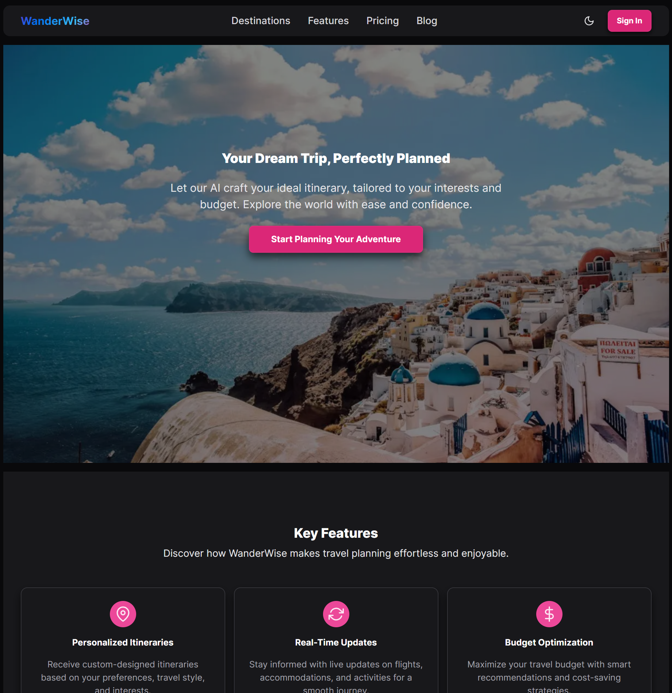

# Hackathon Submission: WanderWise - AI Trip Planner

## Project Title
WanderWise - AI Trip Planner

<b>Project Screenshots</b>

&nbsp;

<b>Desktop</b>

  
  

&nbsp;

  
<b>Mobile</b>

  

## Project Description    

WanderWise is an AI-assisted travel companion built with Next.js 15 and Chakra UI. The goal is to help travellers design personalised itineraries, 
balance budgets, and stay on top of live updates from a single dashboard. The current milestone lays the groundwork: a marketing landing page, 
secure authentication powered by Appwrite, and user profile management.

## Inspiration behind the Project  

The reason I built this project is to help the traveller plan their trip more efficiently, without scrolling through the webpages for relevant information like when to visit, 
mode of transport, hotels and other stay options. Creating or planning a smooth travel journey with family was always very complex, as requirements are different families. 
With the help of Appwrite authentication and databases, I have tried to address those issues. A ton of other features, like converting itineraries to PDF (for download), 
can be shared on WhatsApp, but could not be implemented due to a lack of time. The website can be scaled by availing travel insurance and rerouting options that will allow
users to change the course of the travel journey in case of unavoidable circumstances.

## Tech Stack    

The technologies I used are as follows:

Built on Next.js 15’s App Router with React 19 and TypeScript to structure routes under src/app, keeping the trip planner UI fully client-driven where needed. 

Chakra UI v3 supplies the design system, with custom hooks such as useColorModeValue for theming, so the app is assembled entirely from Chakra 
Primitives and the shared colour-mode helper are located in src/components/ui/colour-mode.tsx.

Authentication, profiles, and future itinerary storage run through Appwrite’s Account and Tables APIs; the configured client is in src/lib/appwrite.client.ts. 
and higher-level auth helpers (email, OAuth, session guards) sit in src/lib/appwrite.service.ts.

AI-assisted planning utilises the OpenAI SDK, featuring a dedicated planning agent that generates structured prompts and serves itinerary content (src/lib/agents/planner.ts).

### Appwrite products

- Auth
- Databases

## Project Repo  

https://github.com/Saptarshi1984/AI-Trip-Planner

## Deployed Site URL

https://ai-trip-planner-lyart-nine.vercel.app/

## Demo Video/Photos  

https://youtu.be/GVxH2ReCiaY